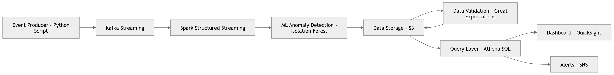
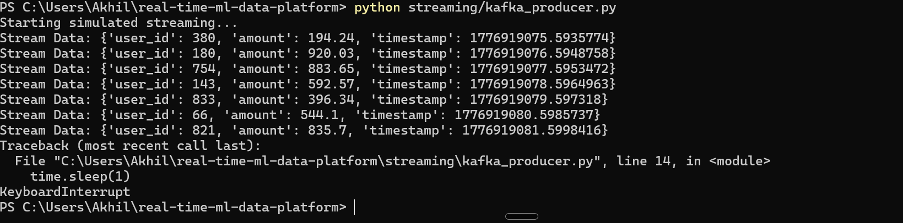
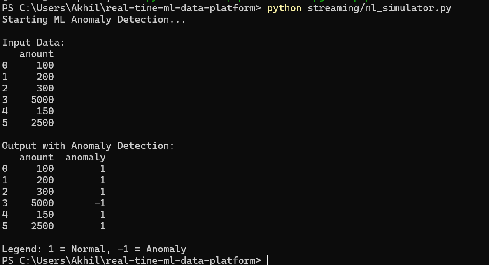

# Real-Time Streaming Data Platform with ML Anomaly Detection

## Overview

This project demonstrates a real-time data pipeline designed to simulate how modern systems process and analyze streaming data. It focuses on handling data as it arrives and applying machine learning to detect anomalies.

To make the project easy to run locally, lightweight simulators are included alongside the architecture design.

## Why this project

In real-world systems, especially in finance and large-scale platforms, data is generated continuously. Detecting anomalies in real time is critical for identifying fraud, system failures, or unusual behavior.

This project brings together streaming concepts, distributed processing, and machine learning in a simplified and practical way.


## What the system does

* Simulates real-time streaming data
* Processes streaming events (architecture design with Kafka + Spark)
* Applies anomaly detection using machine learning
* Validates data quality
* Stores processed data for analysis

## Architecture Diagram

The following diagram represents the end-to-end flow of the streaming pipeline.

<p align="center">
  
</p>

## Local Simulation (Runnable Without Kafka/AWS)

To make this project easy to test locally, simulation scripts are included:

### Streaming Simulator

```bash
python streaming/stream_simulator.py
```

Generates continuous event data in real time.

### ML Simulator

```bash
python streaming/ml_simulator.py
```

Runs anomaly detection on sample data using Isolation Forest.

## Sample Output

### Streaming Simulation Output



### ML Anomaly Detection Output



## Tech Stack

* Python
* Kafka (architecture design)
* Spark (Structured Streaming - design)
* Scikit-learn (Isolation Forest)
* Airflow (orchestration design)
* AWS concepts (S3, Glue, Athena, QuickSight)

## Project Structure

```
real-time-ml-data-platform/
│
├── streaming/
│   ├── kafka_producer.py
│   ├── spark_streaming.py
│   ├── stream_simulator.py      # Local streaming demo
│   └── ml_simulator.py          # Local ML demo
│
├── ml/
│   └── anomaly_detection.py     # Core ML logic
│
├── dags/
│   └── airflow_pipeline.py
│
├── data_quality/
│   └── validation.py
│
├── dashboards/
│   ├── architecture.png
│   ├── stream_output.png
│   └── ml_output.png
```

## What I focused on

* Designing a real-time data pipeline architecture
* Simulating streaming behavior locally
* Integrating machine learning for anomaly detection
* Structuring the project in a modular and scalable way

## Future Improvements

* Deploy pipeline on AWS (MSK, S3, Glue, Athena)
* Add real-time dashboards (QuickSight / Power BI)
* Implement alerting system (SNS / Slack)
* Containerize using Docker
* Extend ML model with more features

## Final Notes

This project demonstrates how streaming pipelines and machine learning can be combined in a real-world system. While the full cloud setup is represented in the architecture, the local simulators provide a practical way to run and validate the core logic.
